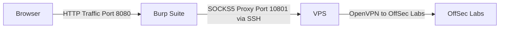
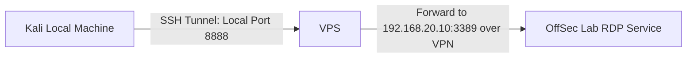

# My Background

For as long as I can remember, I’ve been passionate about IT security. I spent a lot of time learning hacking on platforms like [HackThisSite](https://hackthissite.org) and  [HackTheBox](https://hackthebox.eu). I immersed myself in books and blog posts detailing how hackers infiltrated systems and followed infosec professionals such as Kevin Mitnick, Adrian Crenshaw (aka IronGeek), and Dave Kennedy on Twitter. Along the way, I taught myself Python to automate tasks and took my home network to the next level by setting up multiple subnets. Hacking turned what was already a deep passion for IT into an even more thrilling hobby.

I first began exploring wireless hacking when WEP was still the standard for securing wireless networks—a protocol so flawed that it became infamous for its vulnerabilities.

In 2020, when the COVID pandemic hit, I decided to make a major career shift. I had previously worked in customer service roles but chose to pivot into cybersecurity, dedicating myself to studying for the OSCP. I purchased the OSCP course in June 2020, and after three months of intense preparation, I passed the exam on my first attempt on September 30th.

I wanted to share my OSCP study tips but felt it was more valuable to write about a unique challenge I faced: overcoming connectivity issues to OffSec labs. I decided to document how I managed to connect to the labs using a VPS as a jump server. In this blog, I’ll walk you through that setup and share the tools and strategies that helped me successfully pass the OSCP.

If you're considering using a VPS jump server for your OSCP exam, please contact Offensive Security support to verify if this method is still allowed.

I have also created a video walkthrough for this setup, which you can watch [here](https://www.youtube.com/watch?v=wn0DVX8KwUc), or continue reading for the detailed guide.

---

# My Setup

To overcome my Internet Service Provider’s (ISP) throttling of VPN connections, I connected to both the OSCP lab and exam environments using Kali Linux on a VPS hosted by DigitalOcean. The official Kali documentation shows how to create an image for [DigitalOcean](https://www.kali.org/docs/cloud/digitalocean/). This allowed me to bypass slow connection speeds and maintain a stable connection to the lab.

If you don’t mind paying a bit extra, you can also spin up Kali on Amazon’s AWS EC2 instance from their [marketplace](https://aws.amazon.com/marketplace/pp/prodview-fznsw3f7mq7to). I recommend using an EC2 instance with at least 4GB of RAM since tools like Metasploit require a minimum of 2GB to function smoothly.

Since setting up SSH port forwarding and network traffic pivoting can be complex for the first time, I’ll walk through how I configured Kali in the cloud as a VPS jump server and how I used it to interact with both lab and exam machines.

---
## Tunneling with SSH

Once your VPS is set up, it's time to unlock the full potential of SSH. SSH isn't just for secure login; it offers powerful capabilities such as tunneling and traffic redirection. In my case, I wanted to:
- Mount file systems for easy file transfers.
- Tunnel BurpSuite traffic for proxying web requests.
- Tunnel Remote Desktop Protocol (RDP) over SSH.

## Tunneling BurpSuite Over SSH

To route web traffic through Burp Suite and over SSH, you can use SSH’s dynamic port forwarding feature. This sets up a SOCKS proxy on your local machine, allowing you to forward traffic securely through the VPS.

### Step 1. Establish an SSH connection 

The first step is to establish an SSH connection to your VPS with dynamic port forwarding enabled, allowing you to securely route traffic through a SOCKS proxy. You can do this by running the following command

```bash
ssh -D 10801 kali@Y<VPS_IP>
```
`-D 10801`: This sets up a dynamic SOCKS proxy on port 10801 on your local machine. 

### Step 2. Configure Firefox 
Next configure Firefox to route its HTTP traffic through the proxy.

- In the address bar type `about:preferences` and scroll down to Network Settings.
- Select Manual Proxy Configuration.
- Set:
    * HTTP Proxy: `127.0.0.1`
    * Port: `8080` (the default BurpSuite port)
    * Check the box **Also use this proxy for HTTPS**
    * Check the box at the bottom **Proxy DNS when using SOCKS v5**


{: w="400" h="200" }
_Firefox Connection Settings with proxy set to 127.0.0.1:8080 and SOCKS v5 with DNS proxying enabled._


### Step 3. Configure BurpSuite 
Configure BurpSuite to handle requests through the SOCKS5 proxy:

- In BurpSuite, navigate to User Options > Connections.
- Set the Socks5 proxy to:
    * **Host**: `127.0.0.1`
    * **Port**: `10801`
    * Check the box at the bottom **Do DNS lookups over SOCKS5 proxy**

{: w="600" h="200" }
_Burp Suite settings with SOCKS proxy configured to 127.0.0.1:10801 and DNS lookups routed through the proxy._

### Step 4. Establish a VPN connection to OffSec's Lab

Finally, connect to offsec's labs from your VPS via OpenVPN. Install OpenVPN on Kali VPS and connect.

```bash
sudo apt install openvpn   # Install OpenVPN on Kali VPS
sudo openvpn offsec.ovpn  # Connect the VPS to Offsec, change offsec.ovpn with your config
```

It's important to ensure that both Firefox and Burp Suite are properly configured to resolve IP addresses through the SOCKS5 proxy.

To better understand the data flow, I've created a Mermaid diagram illustrating how traffic moves from your browser through Burp Suite, then via a SOCKS proxy on the VPS, before reaching the OffSec labs over the VPN connection.




## Mounting Directories and Sharing Files over SSH

When working in a remote environment, you may need to transfer files between your local Kali machine and your Kali VPS. To do this efficiently, I recommend using **SSHFS** (SSH File System). SSHFS allows you to mount and interact with directories on a remote server over an SSH connection, providing an easy way to share files.


### Step 1: Create Shared Directories

First, create two directories: one on your Kali VPS (we’ll call this directory VPS_Share) and one on your local Kali machine (we’ll call this directory Local_Share). These directories will be used to share files between the two machines.

On your Kali VPS, run:
```bash
mkdir /home/kali/VPS_Share
```

On your local Kali machine, run:
```bash
mkdir /home/kali/Local_Share
```

### Step 2: Install SSHFS on Kali VPS

Next, you need to install SSHFS on your Kali VPS. SSHFS allows you to mount remote directories over SSH, enabling seamless file sharing.

To install SSHFS on your Kali VPS, run:
```bash
sudo apt install sshfs
```

### Step 3: Start the SSH Server on Your Local Kali Machine

Ensure that the SSH server is running on your local Kali machine. This is necessary because the reverse SSH connection will forward the file system from the local machine to the VPS.

On your local Kali machine, start the SSH service:
```bash
sudo service ssh start
```

### Step 4: Establish SSH Connection from Local Kali to VPS
Now, establish an SSH connection from your local Kali machine to your Kali VPS. This command will enable both dynamic port forwarding (for tunneling web traffic) and reverse SSH (for file sharing).

```bash
ssh -D 10801 -R 10000:127.0.0.1:22 kali@<VPS_IP>  # Run this command from on your local Kali machine, which connects you to the VPS and opens socks
```

- `-D 10801`: Sets up dynamic port forwarding on port 10801 for web traffic.
- `-R 10000`:127.0.0.1:22`: Sets up reverse SSH port forwarding, forwarding traffic from port 10000 on the VPS to port 22 on your local machine (SSH service).

### Step 5: Mount the Local Directory on the VPS

After successfully connecting from your local Kali machine to the Kali VPS, the next step is to mount the Local_Share directory from your local machine to the VPS_Share directory on your VPS using SSHFS.

```bash
sshfs -p 10000 kali@127.0.0.1:/home/kali/Local_Share  /home/kali/VPS_Share/ # Run this command on your Kali VPS, which mounts the Local_Share to your VPS over SSH
```

With this setup, you can now share files between your local machine and VPS, while also tunneling your web traffic over SSH. 

---

## Tunneling Remote Desktop Protocol (RDP) Over SSH



For tunneling RDP traffic, use SSH local port forwarding. Suppose the target machine's IP is `192.168.20.10` and is running RDP on port 3389, use the following command:

```bash
ssh -L 0.0.0.0:8888:192.168.20.10:3389 kali@<VPS_IP>  # Forward RDP session over SSH. Update 192.168.20.10 to your target machine and RDP port number of the box your connecting to as needed. Execute command on local machine.
```

This command establishes a secure SSH tunnel between your local machine and the VPS, allowing traffic to be forwarded to 192.168.20.10:3389 on OffSec’s network over the VPN. By connecting to localhost:8888 on your Kali machine, your connection is tunneled through the VPS to reach OffSec’s network. **Do not forget to replace `192.168.20.10` to the IP address of your target machine that your attempting to connect to.**

On your local machine, you can use the Rdesktop client:

```bash
rdesktop -g 80% -u <username> -p <password> -z -P -x 1 127.0.0.1:8888  # Connect to RDP session using rdesktop. Execute command on Kali local.
```

Alternatively, you can use **xfreerdp**:

```bash
xfreerdp /u:"Username" /v:127.0.0.1:8888 # Alternatively, connect using xfreerdp. Execute command on Kali local.
``` 

---

## Using Tmux for Persistent Sessions

When working on a VPS, Tmux is an essential tool that allows you to maintain persistent sessions. This means that even if your connection drops, your session will remain active. You can also split panes, resize windows, and efficiently multitask using Tmux.


Here are some of the most basic and useful Tmux commands:

- **Split Pane**: `Prefix + SHIFT + “` This splits your current window into two panes, allowing you to run multiple commands in the same session.
- **Resize Pane**: `Prefix + CTRL + Arrow keys` Use this to resize the active pane to your liking.
- **Scroll Up**: `Prefix + [ + PAGE UP` Allows you to scroll up within a pane to view previous output.

Note: By default, the Tmux prefix is CTRL + b. To detach from a session (while it's running in the background), issue the following: Prefix (CTRL + b) + d (where d stands for detach). You can later reattach to the session using tmux attach.

For a deeper dive into Tmux, I highly recommend checking out IppSec’s video tutorial on Tmux [here](https://www.youtube.com/watch?v=Lqehvpe_djs).

---
# Most Useful Tools for the OSCP Exam

During my OSCP journey, I relied heavily on a few specific tools that saved time and made the process more efficient. Below are the most useful tools and resources I used for the OSCP exam:

### [Autorecon](https://github.com/Tib3rius/AutoRecon)

Autorecon automates the enumeration process by scanning open ports and using tools like Nmap, Nikto, and Gobuster. **It saves valuable time** during the exam.

### [Greenshot](https://getgreenshot.org/)

Greenshot is a fast and lightweight screenshot tool. It allows you to annotate and organize screenshots, making it perfect for OSCP note-taking.

### [ligolo-ng](https://github.com/nicocha30/ligolo-ng)

Ligolo-ng is a simple, lightweight and fast tool that allows pentesters to establish tunnels from a reverse TCP/TLS connection using a tun interface (without the need of SOCKS).

### [ssf - Secure Socket Funneling](https://github.com/securesocketfunneling/ssf)

Similar to Ligolo-ng, **Secure Socket Funneling** is a cross-platform network tool that forwards data from multiple TCP or UDP sockets through a single secure TLS tunnel to a remote computer. It is available as a standalone executable for Windows, Linux, and macOS, making it a simple and efficient solution for secure data forwarding. I used SSF during my OSCP Labs to pivot into the IT department's subnet.


---

# Notes and Reporting

For note-taking during the exam, I highly recommend using **Joplin** or **Obsidian**. Both tools support Markdown formatting and work well with screenshots, especially when used with Greenshot. 

**Avoid CherryTree** Some people recommend CherryTree, but I had a bad experience with it. I lost all my notes when pasting in my proof-of-concept (PoC). Stick with more reliable options like Joplin or Obsidian.

**TJNull’s OSCP Reporting Template**: TJNull offers a great OSCP report template, which you can use for both your lab and exam reports. It’s highly recommended for creating structured and clear documentation of your exam process [TJNull’s template](https://github.com/tjnull/TJ-JPT).

---

# Tips for Passing the OSCP

Here are a few key tips that I can share which really helped me pass the OSCP exam:

### 1. Do the Course Exercises

While it may take more time, completing the course exercises is essential. They help you identify your strengths and weaknesses and offer valuable learning opportunities that will help you on the exam.

### 2. Take Screenshots and Detailed Notes

During the exam, document everything as you go. Take screenshots of vulnerabilities and commands, and keep detailed notes. This will not only save time when writing your final report but will also help you remember how you exploited each target.

### 3. Start with the 25-Point Machines

Don’t be intimidated by the 25-point machines. I started my exam by tackling the two 25-point machines while I was still fresh and focused. This allowed me to score higher points early on and build confidence for the rest of the exam.

---

## Additional Resources

Here are some additional resources that I found incredibly helpful during my OSCP preparation:

If your new to Buffer Overflow this is hands down the best learning material you could find **Buffer Overflow Made Easy** by The Cyber Mentor [here](https://www.youtube.com/watch?v=qSnPayW6F7U&list=PLLKT__MCUeix3O0DPbmuaRuR_4Hxo4m3G).

- [Buffer Overflow Made Easy by The Cyber Mentorhere](https://www.youtube.com/watch?v=qSnPayW6F7U&list=PLLKT__MCUeix3O0DPbmuaRuR_4Hxo4m3G) This is hands down the best resource for learning buffer overflow attacks.
- [HackTricks Book](https://book.hacktricks.xyz/) A great reference book for various pentesting techniques and knowledge.
- [PayloadsAllTheThings](https://github.com/swisskyrepo/PayloadsAllTheThings) This GitHub repo is an excellent resource for different payloads and techniques.
- [Ippsec](https://ippsec.rocks/) IppSec’s walkthroughs are invaluable for learning various techniques and methodologies.

Courses on privilege escalation by Tib3rius:
- [Windows Privilege Escalation](https://www.udemy.com/course/windows-privilege-escalation/)
- [Linux Privilege Escalation](https://www.udemy.com/course/linux-privilege-escalation/)

---
## Cheat Sheet

To put everything together, here’s a cheat sheet for easy reference during your OSCP exam preparation:

```bash
# 1.
## Web over SSH - Dynamic Socks proxy for HTTP Traffic
ssh -D 10801 kali@<VPS_IP>  # Establish a dynamic SOCKS proxy. Replace <VPS_IP> with your VPS's IP address. Execute command on Kali local.

# 2.
## Web and SSHFS over SSH 
ssh -D 10801 -R 10000:127.0.0.1:22 kali@<VPS_IP>  # Establish SSH connection with dynamic port forwarding and reverse SSH for file sharing. Execute command on Kali local.
## . Mount Local Directory to VPS 
sshfs -p 10000 kali@127.0.0.1:/home/kali/Local_Share /home/kali/VPS_Share/   # Mount local directory to VPS. Run on VPS.

# 3.
## RDP over SSH
ssh -L 0.0.0.0:8888:192.168.20.10:3389 kali@<VPS_IP>  # Forward RDP session over SSH. Update 192.168.20.10 to your target machine and RDP port number of the box your connecting to as needed. Execute command on local machine.
rdesktop -g 80% -u <UserName> -p <Password> -z -P -x 1 127.0.0.1:8888   # Connect to RDP session using rdesktop. Execute command on Kali local.
xfreerdp /u:"Username" /v:127.0.0.1:8888  # Alternatively, connect using xfreerdp. Execute command on Kali local.
```

### Configure Firefox
Setup Firefox to route all web traffic through the SOCKS proxy created by SSH.

1. Open **Firefox**.
2. In the address bar, enter `about:preferences`.
3. Scroll down to **Network Settings** and click on **Settings…**.
4. Choose **Manual proxy configuration**.
5. Set **SOCKS Host** to `127.0.0.1` and **Port** to `10801`.
6. Select **SOCKS v5**.
7. Check **Proxy DNS when using SOCKS v5**.
8. Click **OK** to save the settings.

### Configure Burp Suite
Setup Burp Suite to intercept and modify HTTP/S traffic routed through the SOCKS proxy.

1. Open **Burp Suite**.
2. Navigate to **User options** > **Connections**.
3. Scroll down to **SOCKS Proxy**.
4. Enable **Use a SOCKS proxy**.
5. Set **SOCKS proxy host** to `127.0.0.1`.
6. Set **SOCKS proxy port** to `10801`.
7. Check **Do DNS lookups over SOCKS5 proxy**.
8. Confirm and restart Burp Suite if necessary to apply changes.

# Conclusion
Overcoming connectivity issues during the OSCP journey can be a major challenge, but with the right tools and setup, it's entirely possible to maintain a stable connection to OffSec labs. By utilizing a VPS as a jump server and leveraging SSH tunneling, you can bypass ISP throttling or restrictive firewalls, such as the Great Firewall of China, allowing you to focus on what truly matters—developing your skills and passing the OSCP exam.

The steps and techniques outlined in this guide are not only relevant for OSCP but can also be adapted for other penetration testing environments. I hope this post proves helpful.

Good luck on your journey, and remember that persistence and preparation are the keys to success in OSCP!