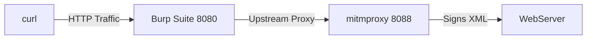

# Introduction

For the past three years as a security consultant testing web applications, I've encountered several projects with unique edge cases—whether it's a client using an unusual serialization format or an outdated technology stack that Burp Suite doesn’t support.

After searching for solutions and finding none, I was left with two options: perform the tests manually or patch together different tools to achieve the desired outcome. In this writeup, I’ll share how I overcame these challenges.

Imagine you're assigned to a security testing engagement where the client uses a SOAP API that requires digitally signing XML, similar to AWS's Sigv4. Unfortunately, Burp Suite doesn’t support this feature and has no plans to add it due to the outdated nature of the technology.

So, how can we script this process?

One limitation with Burp Suite is its Jython integration, which only supports Python 2.7, meaning you can't import external libraries like you could with a regular Python environment. However, one method that worked for me was to route traffic through Burp Suite to Mitmproxy, where a Python function signs the XML before forwarding it to the server.

Here's a method I used:
 - curl sends the request to Burp Suite.
 - Burp forwards the request to Mitmproxy.
 - MITMProxy runs a Python function that signs the XML and sends it to the web server.

Flow



---

## Setup

First, we need to install `mitmproxy` and the required libraries. I recommend installing `mitmproxy` using `pip` in a virtual environment to keep your environment clean.


```bash
# Set up a virtual environment and activate it
python3 -m venv venv
source venv/bin/activate

# Install required dependencies
pip install mitmproxy xmlsec lxml

# Ensure the certificate, key, and XML template are in the same directory
mitmweb -s mitm-xml-signer.py --listen-port 8088  # Web version
mitmproxy -s mitm-xml-signer.py --listen-port 8088  # CLI version

```

### Configure Burp Suite to Use mitmproxy as an Upstream Proxy

To forward traffic from Burp Suite to mitmproxy, configure Burp Suite to use mitmproxy as an upstream proxy.

**Steps in Burp Suite:**

1. Open **Burp Suite** and navigate to Settings.
2. In the **Connections** section under Network, select Upstream Proxy Servers.
3. Click **Add** to configure the upstream proxy settings.
4. Enter the following details:
   - **Destination Host**: `*` (forward all traffic to `mitmproxy`)
   - **Destination Port**: `*`
   - **Proxy Host**: `127.0.0.1` (or the IP where mitmproxy is running)
   - **Proxy Port**: `8088` (the port `mitmproxy` is listening on)
5. Save the configuration by clicking **OK**. 


{: .light }
{: .dark }
_Burp Suite "Connections" with upstream proxy set to 127.0.0.1:8088 for all traffic._

### XML Template

For our mitmproxy script to sign the XML body correctly, I tailored the script to parse and look for the Body element with an Id attribute—that is, `<Body Id="">`——as this was the requirement based on the SOAP API I was testing. Depending on how your client's SOAP API is structured, you will need to tailor the script accordingly.

```xml
<soapenv:Envelope xmlns:soapenv="http://schemas.xmlsoap.org/soap/envelope/"
                  xmlns:ns="http://example.com/namespace">
    <soapenv:Header/>
    <soapenv:Body Id="1">
        <ns:MyRequest>
            <ns:Data>Sample data</ns:Data>
        </ns:MyRequest>
    </soapenv:Body>
</soapenv:Envelope>
```


### Python Script to Sign XML

Below is the Python script that will be executed by mitmproxy to sign the XML. Make sure you place the certificate, private key, and this script in the same directory.

```python
import mitmproxy.http
from mitmproxy import http
import xmlsec
from lxml import etree
from OpenSSL import crypto
import os 

'''
Instructions:
1. Update the following variables as needed:
   - private_key_password = "secret" (or set to None if not required)
   - private_key_path = "privatekey.pem"
   - cert_path = "cert.pem"

2. To set the PRIVATE_KEY_PASSWORD environment variable, use the following command:
   - Linux/macOS: export PRIVATE_KEY_PASSWORD="your_password_here"
   - Windows: set PRIVATE_KEY_PASSWORD=your_password_here

3. To run the script with mitmproxy:
   mitmweb -s mitm-xml-signer.py --listen-port 8888
'''

def load_private_key_with_password(private_key_path, password):
    try:
        with open(private_key_path, "rb") as key_file:
            private_key_data = key_file.read()
        
        private_key = crypto.load_privatekey(crypto.FILETYPE_PEM, private_key_data, passphrase=password.encode())
        return private_key
    except Exception as e:
        print(f"Failed to load or decrypt private key: {e}")
        return None

def load_certificate_details(cert_path):
    try:
        with open(cert_path, "rb") as cert_file:
            cert_data = cert_file.read()
            certificate = crypto.load_certificate(crypto.FILETYPE_PEM, cert_data)
        
        issuer = certificate.get_issuer()
        serial_number = certificate.get_serial_number()
        return certificate, issuer, serial_number
    except Exception as e:
        print(f"Failed to load certificate: {e}")
        return None, None, None

# Updated add_key_info to only include O and OU
def add_key_info(signature_node, issuer, serial_number):
    key_info = xmlsec.template.ensure_key_info(signature_node)
    x509_data = xmlsec.template.add_x509_data(key_info)

    issuer_serial_node = etree.SubElement(x509_data, "{http://www.w3.org/2000/09/xmldsig#}X509IssuerSerial")
    issuer_name_node = etree.SubElement(issuer_serial_node, "{http://www.w3.org/2000/09/xmldsig#}X509IssuerName")

    # Filter issuer components to include only 'O' and 'OU'
    desired_components = [b'O', b'OU']  # Components you want to include
    issuer_components = [
        (name.decode(), value.decode())
        for name, value in issuer.get_components()
        if name in desired_components
    ]

    # Build the issuer name string
    issuer_name_node.text = ", ".join([f"{name}={value}" for name, value in issuer_components])

    serial_number_node = etree.SubElement(issuer_serial_node, "{http://www.w3.org/2000/09/xmldsig#}X509SerialNumber")
    serial_number_node.text = str(serial_number)

def sign_xml(xml_str, private_key_password):
    xml = etree.fromstring(xml_str)

    private_key_path = "privatekey.pem"
    cert_path = "cert.pem"

    private_key = load_private_key_with_password(private_key_path, private_key_password)
    if private_key is None:
        return None

    certificate, issuer, serial_number = load_certificate_details(cert_path)
    if certificate is None:
        return None

    sign_ctx = xmlsec.SignatureContext()
    key = xmlsec.Key.from_file(private_key_path, xmlsec.KeyFormat.PEM, password=private_key_password)
    key.load_cert_from_file(cert_path, xmlsec.KeyFormat.PEM)
    sign_ctx.key = key

    # Extract namespace mappings
    nsmap = xml.nsmap
    nsmap_rev = {v: k for k, v in nsmap.items()}

    # Get the SOAP envelope namespace and prefix
    soapenv_ns = 'http://schemas.xmlsoap.org/soap/envelope/'
    soapenv_prefix = nsmap_rev.get(soapenv_ns)
    if soapenv_prefix is None:
        raise ValueError("SOAP envelope namespace is not defined in the XML.")

    # Find the Body element using the namespace prefix
    body = xml.find(f'.//{{{soapenv_ns}}}Body')
    if body is None:
        raise ValueError("SOAP Body not found!")

    # Register the 'id' or 'Id' attribute
    id_attr_name = None
    for attr_name in ['Id', 'id']:
        if body.get(attr_name) is not None:
            id_attr_name = attr_name
            break
    if id_attr_name is None:
        raise ValueError("Body element does not have 'Id' or 'id' attribute.")

    # Register the ID attribute
    xmlsec.tree.add_ids(body, [id_attr_name])

    # Find the Header element; if it doesn't exist, create it
    header = xml.find(f'.//{{{soapenv_ns}}}Header')
    if header is None:
        # Find the Envelope element
        envelope = xml.find(f'.//{{{soapenv_ns}}}Envelope')
        if envelope is None:
            raise ValueError("SOAP Envelope not found!")

        # Create the Header element with the existing namespace prefix
        header_tag = f'{{{soapenv_ns}}}Header'
        header = etree.SubElement(envelope, header_tag, nsmap={soapenv_prefix: soapenv_ns})

    # Create the Signature node
    signature_node = xmlsec.template.create(xml, xmlsec.Transform.EXCL_C14N, xmlsec.Transform.RSA_SHA1)

    header.append(signature_node)

    # Specify the URI to point to the Body's Id
    ref = xmlsec.template.add_reference(signature_node, xmlsec.Transform.SHA1, uri=f"#{body.get(id_attr_name)}")
    xmlsec.template.add_transform(ref, xmlsec.Transform.ENVELOPED)
    xmlsec.template.add_transform(ref, xmlsec.Transform.EXCL_C14N)

    add_key_info(signature_node, issuer, serial_number)

    # Sign the signature node
    try:
        sign_ctx.sign(signature_node)
    except Exception as e:
        print(f"Error during signing: {e}")
        return None

    return etree.tostring(xml, pretty_print=True).decode()

# Mitmproxy addon to intercept and modify requests
class XMLSigner:
    def __init__(self):
        self.private_key_password = os.getenv('PRIVATE_KEY_PASSWORD') 

    def request(self, flow: mitmproxy.http.HTTPFlow):
        # Check if the request is an XML (you can refine this check)
        if "xml" in flow.request.headers.get("Content-Type", "").lower():
            xml_content = flow.request.content

            try:
                signed_xml = sign_xml(xml_content, self.private_key_password)
                if signed_xml:
                    flow.request.content = signed_xml.encode('utf-8')
                    print("XML request successfully signed.")
                else:
                    print("Failed to sign XML.")
            except Exception as e:
                print(f"Error during XML signing: {e}")


addons = [
    XMLSigner() 
]


```


### Running the Script

To execute the script, ensure the necessary files (Certificate, Key, and XML template) are in the same directory as mitmproxy and run mitmweb with the provided script:

```bash
mitmweb -s mitm-xml-signer.py --listen-port 8088 
```

Once mitmweb is running, you can visit the web interface to inspect the flows:
[http://127.0.0.1:8081/#/flows](http://127.0.0.1:8081/#/flows)

Finally, we send a curl request to Burp Suite and verify mitm is signing the xml

### Verifying with Curl

Finally, send a request using `curl` to Burp Suite, which will forward it to `mitmproxy` to sign the XML:

```bash
curl --location \
     --request POST "https://www.example.com/" \
     --header "Content-Type: text/xml; charset=utf-8" \
     --data @template.xml \
     --proxy http://127.0.0.1:8080 \
     --insecure \
     -v 
```

{: .light }
{: .dark }
_mitmproxy script in action signing xml requests._

### Limitations and Considerations

While this solution offers a practical method for automating the signing of SOAP requests during testing, it's important to be aware of its limitations and potential impact on your workflow.

Firstly, the provided Python script is primarily intended for demonstration purposes. It's tailored to work with a specific structure of the SOAP XML envelope. If your SOAP messages use a different structure, namespaces, or include additional elements, you'll need to adjust the XML parsing logic within the script. This may involve modifying how the script locates the `<Envelope>`, `<Header>`, and `<Body>` elements, as well as how it handles namespaces. Ensuring that the script aligns with your specific XML schema is crucial for it to function correctly.

Another consideration is the effect of using mitmproxy as an upstream proxy on Burp Suite's functionality. Specifically, configuring Burp Suite to forward traffic to mitmproxy can interfere with the Burp Collaborator feature. Burp Collaborator relies on making HTTPS requests to detect out-of-band interactions, and when these requests are routed through mitmproxy, they may fail due to SSL issues. This happens because mitmproxy, acting as an upstream proxy, might not handle these HTTPS requests properly, leading to unsuccessful interactions.

To mitigate this issue, you have a couple of options. One approach is to toggle the upstream proxy settings in Burp Suite as needed. When you require Burp Collaborator for testing, you can disable the upstream proxy settings to allow Burp to handle HTTPS requests directly. Once you're done, you can re-enable the upstream proxy to continue using mitmproxy for signing SOAP requests. While this method works, it can be somewhat cumbersome to repeatedly change settings during your testing sessions.

Alternatively, you can configure Burp Collaborator to use unencrypted HTTP instead of HTTPS. This adjustment allows the Collaborator traffic to pass through mitmproxy without encountering SSL-related problems. However, this approach has security implications. Using HTTP instead of HTTPS means the data is transmitted in plain text, which could be a concern in environments where security is paramount. Before opting for this solution, ensure it complies with your organization's security policies and the requirements of your testing engagement.

### Conclusion

I hope this guide helps you overcome similar challenges in your next project or security engagement. By using mitmproxy alongside Burp Suite, you can handle complex scenarios like digitally signing SOAP requests or working with custom serializers—even when your usual tools fall short. This approach demonstrates how integrating different tools can extend your capabilities and adapt to unique testing requirements. I encourage you to experiment with this method and tailor it to your specific needs, pushing the boundaries of what's possible in security testing.


---


