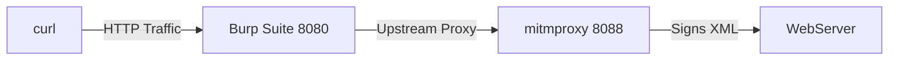

# Introduction

For the past three years as a security consultant testing web applications, I've encountered several projects with unique edge cases—whether it's a client using an unusual serialization format or an outdated technology stack that Burp Suite doesn’t support.

After searching for solutions and finding none, I was left with two options: perform the tests manually or patch together different tools to achieve the desired outcome. In this writeup, I’ll share how I overcame these challenges.

Imagine you're assigned to a security testing engagement where the client uses a SOAP API that requires digitally signing XML, similar to AWS's Sigv4. Unfortunately, Burp Suite doesn’t support this feature and has no plans to add it due to the outdated nature of the technology.

So, how can we script this process?

One limitation with Burp Suite is its Jython integration, which only supports Python 2.7, meaning you can't import external libraries like you could with a regular Python environment. However, one method that worked for me was to route traffic through Burp Suite to Mitmproxy, where a Python function signs the XML before forwarding it to the server.

Here's a method I used:
 - curl sends the request to Burp Suite.
 - Burp forwards the request to Mitmproxy.
 - MITMProxy runs a Python function that signs the XML and sends it to the web server.

Flow



---

## Setup

First, we need to install `mitmproxy` and the required libraries. I recommend installing `mitmproxy` using `pip` in a virtual environment to keep your environment clean.


```bash
# Set up a virtual environment and activate it
python3 -m venv venv
source venv/bin/activate

# Install required dependencies
pip install mitmproxy xmlsec lxml

# Ensure the certificate, key, and XML template are in the same directory
mitmweb -s mitm-xml-signer.py --listen-port 8088  # Web version
mitmproxy -s mitm-xml-signer.py --listen-port 8088  # CLI version

```

### Configure Burp Suite to Use mitmproxy as an Upstream Proxy

To forward traffic from Burp Suite to mitmproxy, configure Burp Suite to use mitmproxy as an upstream proxy.

**Steps in Burp Suite:**

1. Open **Burp Suite** and navigate to Settings.
2. In the **Connections** section under Network, select Upstream Proxy Servers.
3. Click **Add** to configure the upstream proxy settings.
4. Enter the following details:
   - **Destination Host**: `*` (forward all traffic to `mitmproxy`)
   - **Destination Port**: `*`
   - **Proxy Host**: `127.0.0.1` (or the IP where mitmproxy is running)
   - **Proxy Port**: `8088` (the port `mitmproxy` is listening on)
5. Save the configuration by clicking **OK**. 


{: .light }
{: .dark }
_Burp Suite "Connections" with upstream proxy set to 127.0.0.1:8088 for all traffic._

### XML Template

For `mitmproxy` to sign the XML correctly, we need a placeholder in the XML for the signature. Here's an example of an XML template with the necessary placeholders:

```xml
<?xml version="1.0" encoding="UTF-8"?>
<soapenv:Envelope
	xmlns:soapenv="http://schemas.xmlsoap.org/soap/envelope/"
	xmlns:wsse="http://docs.oasis-open.org/wss/2004/01/oasis-200401-wss-wssecurity-secext-1.0.xsd">
	
	<!-- The digital signature will be inserted here by mitmproxy -->
	<ds:Signature
		xmlns:ds="http://www.w3.org/2000/09/xmldsig#">
		<ds:SignedInfo>
			<ds:CanonicalizationMethod Algorithm="http://www.w3.org/2001/10/xml-exc-c14n#"/>
			<ds:SignatureMethod Algorithm="http://www.w3.org/2000/09/xmldsig#rsa-sha1"/>
			<ds:Reference URI="">
				<ds:Transforms>
					<ds:Transform Algorithm="http://www.w3.org/2000/09/xmldsig#enveloped-signature"/>
					<ds:Transform Algorithm="http://www.w3.org/2001/10/xml-exc-c14n#"/>
				</ds:Transforms>
				<ds:DigestMethod Algorithm="http://www.w3.org/2000/09/xmldsig#sha1"/>
				<ds:DigestValue></ds:DigestValue>
			</ds:Reference>
		</ds:SignedInfo>
		<ds:SignatureValue></ds:SignatureValue>
		<ds:KeyInfo>
			<ds:X509Data>
				<ds:X509Certificate></ds:X509Certificate>
			</ds:X509Data>
		</ds:KeyInfo>
	</ds:Signature>
	

	<soapenv:Body>
		<getDetails>
			<customerID>12345</customerID>
		</getDetails>
	</soapenv:Body>
</soapenv:Envelope>

```


### Python Script to Sign XML

Below is the Python script that will be executed by mitmproxy to sign the XML. Make sure you place the certificate, private key, and this script in the same directory.

```python
from mitmproxy import http
import xmlsec
from lxml import etree

def sign_xml(xml_str):
    """
    Function to sign the XML using xmlsec and return the signed XML as a string.
    """
    # Parse the incoming XML
    xml = etree.fromstring(xml_str)

    # Initialize the XML security context
    sign_ctx = xmlsec.SignatureContext()

    # Load the private key and certificate - UPDATE PASSWORD 
    key = xmlsec.Key.from_file("privatekey.pem", xmlsec.KeyFormat.PEM, password="topsecret")
    key.load_cert_from_file("certificate.pem", xmlsec.KeyFormat.PEM)

    # Attach the key to the security context
    sign_ctx.key = key

    # Find the place to insert the signature (inside the SOAP header)
    signature_node = xmlsec.template.create(xml, xmlsec.Transform.EXCL_C14N, xmlsec.Transform.RSA_SHA1)

    # Append the signature node to the correct location in your XML (e.g., inside <SOAP-ENV:Header>)
    header = xml.find(".//{http://schemas.xmlsoap.org/soap/envelope/}Header")
    if header is not None:
        header.append(signature_node)
    else:
        raise ValueError("SOAP Header not found!")

    # Add required transforms, canonicalization, and signature method
    ref = xmlsec.template.add_reference(signature_node, xmlsec.Transform.SHA1)
    xmlsec.template.add_transform(ref, xmlsec.Transform.ENVELOPED)
    xmlsec.template.add_transform(ref, xmlsec.Transform.EXCL_C14N)

    # Add KeyInfo for X.509 certificate
    key_info = xmlsec.template.ensure_key_info(signature_node)
    xmlsec.template.add_x509_data(key_info)

    # Sign the XML
    sign_ctx.sign(signature_node)

    # Return the signed XML as a string
    return etree.tostring(xml, pretty_print=True)


class SOAPSigner:
    def __init__(self):
        pass

    def request(self, flow: http.HTTPFlow) -> None:
        """
        Intercept the request, sign the XML payload if it's a SOAP request, and continue the flow.
        """
        # Check if the content type is SOAP (XML-based)
        if "application/soap+xml" in flow.request.headers.get("Content-Type", "") or "text/xml" in flow.request.headers.get("Content-Type", ""):
            # Parse the SOAP XML body
            soap_body = flow.request.content

            try:
                # Sign the XML
                signed_xml = sign_xml(soap_body)

                # Replace the request content with the signed XML
                flow.request.content = signed_xml

                print("XML signed successfully")
            except Exception as e:
                print(f"Error signing XML: {e}")


addons = [
    SOAPSigner()
]

```

### Running the Script

To execute the script, ensure the necessary files (Certificate, Key, and XML template) are in the same directory as mitmproxy and run mitmweb with the provided script:

```bash
mitmweb -s mitm-xml-signer.py --listen-port 8088 
```

Once mitmweb is running, you can visit the web interface to inspect the flows:
[http://127.0.0.1:8081/#/flows](http://127.0.0.1:8081/#/flows)

Finally, we send a curl request to Burp Suite and verify mitm is signing the xml

### Verifying with Curl

Finally, send a request using `curl` to Burp Suite, which will forward it to `mitmproxy` to sign the XML:

```bash
curl --location \
     --request POST "https://www.example.com/" \
     --header "Content-Type: text/xml; charset=utf-8" \
     --data @template.xml \
     --proxy http://127.0.0.1:8080 \
     --insecure \
     -v 
```
### Conclusion

I hope this guide helps you overcome similar challenges in your next project or security engagement. Using mitmproxy alongside Burp Suite allows you to handle complex scenarios like digitally signing SOAP requests, even when your usual tools fall short.


---


